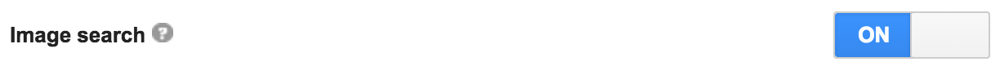

# google-images

[](https://travis-ci.org/vdemedes/google-images)
[](https://coveralls.io/github/vdemedes/google-images?branch=master)

This module for Node.js helps searching images using Google Images.
It provides just one method, *search*, simplicity FTW.


## Installation

```
$ npm install google-images --save
```


## Usage

**Note**: You'll need to [set up your own Google Custom Search Engine](#set-up-google-custom-search-engine) to search for images.

```js
const googleImages = require('google-images');

let client = googleImages('CSE ID', 'API KEY');

client.search('Steve Angello')
	.then(function (images) {
		/*
		[{
			"url": "http://steveangello.com/boss.jpg",
			"type": "image/jpeg",
			"width": 1024,
			"height": 768,
			"size": 102451,
			"thumbnail": {
				"url": "http://steveangello.com/thumbnail.jpg",
				"width": 512,
				"height": 512
			}
		}]
		 */
	});

// paginate results
client.search('Steve Angello', {
	page: 2
});

// search for certain size
client.search('Steve Angello', {
	size: 'large'
});
```


## Set up Google Custom Search Engine

Google deprecated their public Google Images API, so to search for images you need to sign up for Google Custom Search Engine.
Here are the steps you need to do:

### 1. Create a Google Custom Search Engine

You can do this here: [https://cse.google.com/cse](https://cse.google.com/cse).

Do not specify any sites to search but instead use the "Restrict Pages using Schema.org Types" under the "Advanced options".
For the most inclusive set, use the Schema: `Thing`. Make a note of the CSE ID.

### 2. Enable Image Search

In your search engine settings, enable "Image search":



### 3. Set up a Google Custom Search Engine API

Register a new app and enable Google Custom Search Engine API here: [Google Developers Console](https://console.developers.google.com).
Make a note of the API key.


## Tests

```
$ npm test
```


## License

MIT © [Vadym Demedes](http://vadimdemedes.com)
